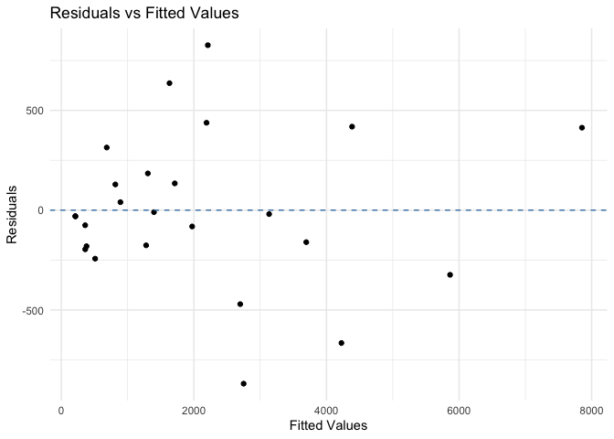
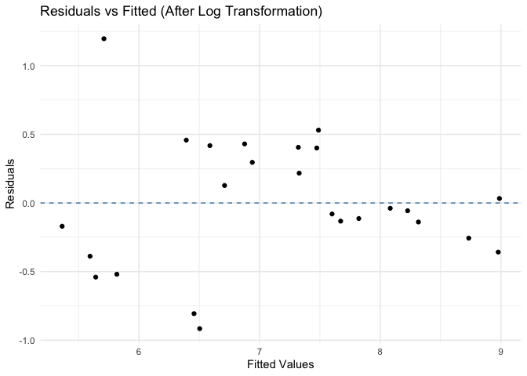
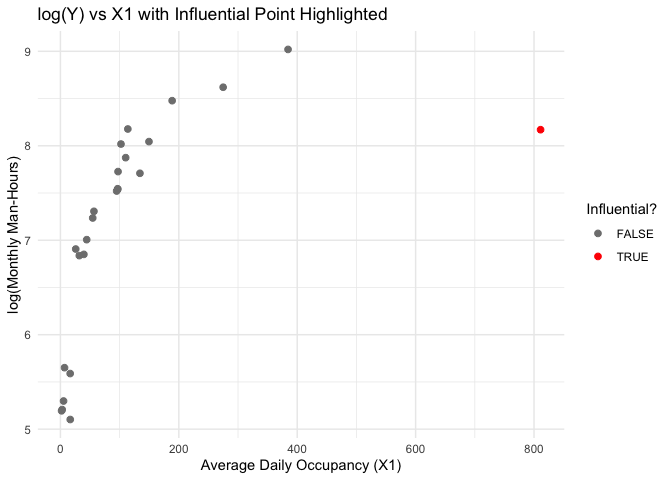
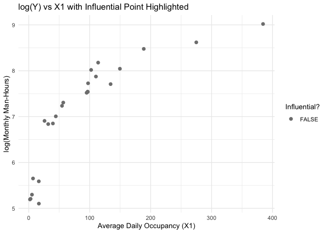
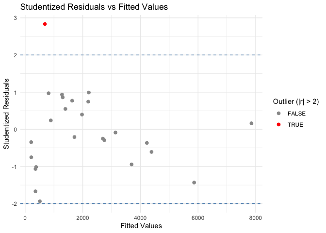

##### Devon Park (dap2189)

##### Assignment 3 - Due 13NOV25

``` r
library(readxl)
library(dplyr)
library(ggplot2)
library(tibble)
```

### Question 1

The data below show plasma inorganic phosphate measurements obtained
from 13 controls (‘group’ = 0) and 20 obese patients (‘group’ =1) taken
initially (‘initial’) and 3 hours after an oral glucose challenge
(‘final’). The aim is to find if there is a difference in the final
phosphate measurements between the two groups after adjusting for any
initial difference.

| group | initial | final |
|------:|--------:|------:|
|     0 |     4.3 |   2.5 |
|     0 |     3.7 |   3.2 |
|     0 |     4.0 |   3.1 |
|     0 |     3.6 |   3.9 |
|     0 |     4.1 |   3.4 |
|     0 |     3.8 |   3.6 |

First few rows of Q1 dataset

#### (a) Write down a simple ANCOVA model for data shown, using the control group as a reference.

    ## 
    ## Call:
    ## lm(formula = final ~ group + initial, data = Q1)
    ## 
    ## Residuals:
    ##     Min      1Q  Median      3Q     Max 
    ## -1.0570 -0.4166  0.1031  0.4629  0.8495 
    ## 
    ## Coefficients:
    ##             Estimate Std. Error t value Pr(>|t|)    
    ## (Intercept)   0.8888     0.6373   1.395   0.1733    
    ## group        -0.2340     0.2154  -1.086   0.2860    
    ## initial       0.6005     0.1508   3.983   0.0004 ***
    ## ---
    ## Signif. codes:  0 '***' 0.001 '**' 0.01 '*' 0.05 '.' 0.1 ' ' 1
    ## 
    ## Residual standard error: 0.5755 on 30 degrees of freedom
    ## Multiple R-squared:  0.3462, Adjusted R-squared:  0.3026 
    ## F-statistic: 7.942 on 2 and 30 DF,  p-value: 0.001706

Parallel slopes Model:

$final = \beta_0 + \beta_1 * group + \beta_2 * initial + \epsilon$

<mark> Model with coefficients: </mark>
$final = 0.889 - 0.234x_{group} + 0.601x_{initial}$

*Note: group = 0 for the control (reference group) and group = 1 for
obese patients.*

#### (b) Test for any difference in the outcome between the two groups.

Looking at our regression model, we see the coefficient for variable
group is $-0.234$ with a p-value of $0.286$. This means that the
adjusted difference in the final phosphate readings for obese
participants compared to control participants is $-0.234$. However, the
p-value is greater than 0.05 which means this difference is not
statistically significant at the 5% significance level.

#### (c) Does the initial phosphate value contribute significantly to the final phosphate value?

Looking at our regression model, we see the coefficient for variable
initial is $0.601$ with a p-value of $0.004$. This means that for every
one unit increase in initial phosphate value, the final phosphate value
increases by roughly 0.6 units, after adjusting for group. That the
p-value is less than 0.05 suggests the association between initial and
final phosphate scores is statistically significant.

#### (d) Repeat the ANCOVA without assuming parallel slopes for the two groups

The interaction term tests whether the relation between initial and
final phosphate values differ by group. If slopes are parallel
$\beta_3=0$.

    ## 
    ## Call:
    ## lm(formula = final ~ group + initial + group:initial, data = Q1)
    ## 
    ## Residuals:
    ##     Min      1Q  Median      3Q     Max 
    ## -1.0575 -0.4316  0.1190  0.4544  0.8917 
    ## 
    ## Coefficients:
    ##               Estimate Std. Error t value Pr(>|t|)  
    ## (Intercept)     0.5380     1.5830   0.340    0.736  
    ## group           0.1900     1.7593   0.108    0.915  
    ## initial         0.6862     0.3848   1.783    0.085 .
    ## group:initial  -0.1019     0.4195  -0.243    0.810  
    ## ---
    ## Signif. codes:  0 '***' 0.001 '**' 0.01 '*' 0.05 '.' 0.1 ' ' 1
    ## 
    ## Residual standard error: 0.5847 on 29 degrees of freedom
    ## Multiple R-squared:  0.3475, Adjusted R-squared:   0.28 
    ## F-statistic: 5.148 on 3 and 29 DF,  p-value: 0.005628

    ## Analysis of Variance Table
    ## 
    ## Model 1: final ~ group + initial
    ## Model 2: final ~ group + initial + group:initial
    ##   Res.Df    RSS Df Sum of Sq     F Pr(>F)
    ## 1     30 9.9359                          
    ## 2     29 9.9157  1  0.020172 0.059 0.8098

Non-parallel slopes Model:

$final = \beta_0 + \beta_1 * group + \beta_2 * initial + \beta_3 * (group*initial) + \epsilon$

<mark> Model with coefficients: </mark>
$final = 0.538 + 0.190x_{group} + 0.686x_{initial} - 0.102x_{group*initial}$

*Note: group = 0 for the control patients (reference group) and group =
1 for obese patients.*

The interaction term in model2 is $\beta_3=-0.102$ with a p-value of
$0.810$. That the p-value is \>0.05 suggests that initial and final
phosphate values are not statistically significantly different depending
on group. In other words, the association between initial and final
phosphate scores is roughly similar across both groups.

Additionally, I ran `anova(m1, m2)` to compare m1 (parallel slopes
model) with m2 (non-parallel slopes model). From this test, I get an F
test statistic of $0.059$ with a p-value of $0.810$ suggesting that
adding the interaction term does not significantly improve the model. In
other words, we fail to reject the null hypothesis $H_0: \beta_3 =0$.

## Question 2

The US Navy attempts to develop equations for estimation of manpower
needs for manning installations such as Bachelor Officers Quarters
(BOQ). Regression equations are developed from data taken by measurement
teams. The data in the attached excel file were collected from 25 BOQ
sites.

###### Variables of Dataset:

$X_1$ = average daily occupancy

$X_2$ = monthly average number of check-ins

$X_3$ = weekly hours of service desk operation

$X_4$ = square feet of common use area

$X_5$ = Number of building wings

$X_6$ = operational berthing capacity

$X_7$ = number of rooms

$Y$ = monthly man-hours

#### (a) *Fit* the regression model

| Site |   x1 |    x2 |    x3 |   x4 |  x5 |  x6 |  x7 |      y |
|-----:|-----:|------:|------:|-----:|----:|----:|----:|-------:|
|    1 |  2.0 |  4.00 |   4.0 | 1.26 |   1 |   6 |   6 | 180.23 |
|    2 |  3.0 |  1.58 |  40.0 | 1.25 |   1 |   5 |   5 | 182.61 |
|    3 | 16.6 | 23.78 |  40.0 | 1.00 |   1 |  13 |  13 | 164.38 |
|    4 |  7.0 |  2.37 | 168.0 | 1.00 |   1 |   7 |   8 | 284.55 |
|    5 |  5.3 |  1.67 |  42.5 | 7.79 |   3 |  25 |  25 | 199.92 |
|    6 | 16.5 |  8.25 | 168.0 | 1.12 |   2 |  19 |  19 | 267.38 |

First few rows of Q2 dataset

    ## 
    ## Call:
    ## lm(formula = y ~ x1 + x2 + x3 + x4 + x5 + x6 + x7, data = Q2)
    ## 
    ## Residuals:
    ##     Min      1Q  Median      3Q     Max 
    ## -869.39 -180.75  -29.81  184.22  826.55 
    ## 
    ## Coefficients:
    ##             Estimate Std. Error t value Pr(>|t|)    
    ## (Intercept) 135.0380   237.7999   0.568  0.57755    
    ## x1           -1.2841     0.8046  -1.596  0.12895    
    ## x2            1.8040     0.5163   3.494  0.00278 ** 
    ## x3            0.6686     1.8463   0.362  0.72170    
    ## x4          -21.4363    10.1701  -2.108  0.05020 .  
    ## x5            5.6224    14.7452   0.381  0.70770    
    ## x6          -14.4896     4.2196  -3.434  0.00317 ** 
    ## x7           29.3349     6.3643   4.609  0.00025 ***
    ## ---
    ## Signif. codes:  0 '***' 0.001 '**' 0.01 '*' 0.05 '.' 0.1 ' ' 1
    ## 
    ## Residual standard error: 455.1 on 17 degrees of freedom
    ## Multiple R-squared:  0.9613, Adjusted R-squared:  0.9453 
    ## F-statistic: 60.27 on 7 and 17 DF,  p-value: 9.199e-11

From our regression model I get the following result: Regression Model
Form:
$Y = \beta_0 + \beta_1x_1 + \beta_2x_2 + \beta_3x_3 + \beta_4x_4 + \beta_5x_5 + \beta_6x_6 + \beta_7x_7 + \epsilon$

<mark> Regresssion Model:</mark>
$Y = 135.038 - 1.284x_1 + 1.804x_2 + 0.669x_3 - 21.436x_4 + 5.622x_5 - 14.490x_6 + 29.335x_7$

#### (b) Perform a residual plot and make any necessary transformations.

<!-- -->

Based on the residual plot, we see a funneling effect suggesting
heteroscedasticity (residuals spreading as our fitted values increase).
This suggests that we should transform our data using a natural log.

#### (c) Refit a linear regression based on your transformation.

Refit the model with the transformation:

    ## 
    ## Call:
    ## lm(formula = log_y ~ x1 + x2 + x3 + x4 + x5 + x6 + x7, data = Q2)
    ## 
    ## Residuals:
    ##     Min      1Q  Median      3Q     Max 
    ## -0.9152 -0.2561 -0.0565  0.4004  1.1965 
    ## 
    ## Coefficients:
    ##               Estimate Std. Error t value Pr(>|t|)    
    ## (Intercept)  5.290e+00  2.901e-01  18.235 1.35e-12 ***
    ## x1          -9.815e-05  9.816e-04  -0.100  0.92152    
    ## x2           5.637e-04  6.298e-04   0.895  0.38324    
    ## x3           6.612e-03  2.252e-03   2.936  0.00924 ** 
    ## x4           1.857e-02  1.241e-02   1.497  0.15270    
    ## x5          -8.452e-03  1.799e-02  -0.470  0.64443    
    ## x6          -4.957e-03  5.148e-03  -0.963  0.34905    
    ## x7           1.001e-02  7.764e-03   1.290  0.21438    
    ## ---
    ## Signif. codes:  0 '***' 0.001 '**' 0.01 '*' 0.05 '.' 0.1 ' ' 1
    ## 
    ## Residual standard error: 0.5552 on 17 degrees of freedom
    ## Multiple R-squared:  0.8407, Adjusted R-squared:  0.775 
    ## F-statistic: 12.81 on 7 and 17 DF,  p-value: 1.138e-05

Check residuals again: - After the log transformation, we see that our
residuals form a cloud like shape suggesting a more even spread.
<!-- -->

Now that we have log transformed our data, a new interpretation of our
results would be as follows: - A one-unit increase in $x_i$ is
associated with an estimated $100 * β_i$ % change in monthly man-hours,
holding the other variables constant.

#### (d) Compute the hat diagonals, Standardized residuals, Cook’s distance, and Studentized residuals for the model in (c)

| Site | x1 | x2 | x3 | x4 | x5 | x6 | x7 | y | residuals | fitted | log_y | residuals_log | fitted_log | hat | std_resid | stud_resid | cooks |
|---:|---:|---:|---:|---:|---:|---:|---:|---:|---:|---:|---:|---:|---:|---:|---:|---:|---:|
| 1 | 2.0 | 4.00 | 4.0 | 1.26 | 1 | 6 | 6 | 180.23 | -29.81454 | 210.0445 | 5.194234 | -0.1696077 | 5.363842 | 0.2572906 | -0.3544546 | -0.3451493 | 0.0054405 |
| 2 | 3.0 | 1.58 | 40.0 | 1.25 | 1 | 5 | 5 | 182.61 | -31.22472 | 213.8347 | 5.207353 | -0.3878111 | 5.595164 | 0.1608819 | -0.7624884 | -0.7527054 | 0.0139335 |
| 3 | 16.6 | 23.78 | 40.0 | 1.00 | 1 | 13 | 13 | 164.38 | -196.16066 | 360.5407 | 5.102181 | -0.5399767 | 5.642157 | 0.1614154 | -1.0620039 | -1.0662726 | 0.0271369 |
| 4 | 7.0 | 2.37 | 168.0 | 1.00 | 1 | 7 | 8 | 284.55 | -75.54300 | 360.0930 | 5.650909 | -0.8061129 | 6.457022 | 0.1631124 | -1.5870363 | -1.6681798 | 0.0613626 |
| 5 | 5.3 | 1.67 | 42.5 | 7.79 | 3 | 25 | 25 | 199.92 | -180.75244 | 380.6724 | 5.297917 | -0.5193157 | 5.817233 | 0.1474845 | -1.0129893 | -1.0138181 | 0.0221903 |
| 6 | 16.5 | 8.25 | 168.0 | 1.12 | 2 | 19 | 19 | 267.38 | -242.98030 | 510.3603 | 5.588671 | -0.9151818 | 6.503853 | 0.1588951 | -1.7972431 | -1.9373191 | 0.0762753 |

#### (e) Identify any influential points and discuss the nature of the influence.

Points that are high leverage look at how far an observation’s x values
are from the mean of all x’s.

We can use cooks distance to look at how much the fitted model changes
when a certain observation is removed. WE consider a point influential
if D (cook’s distance) is greater than 1.

| Site | x1 | x2 | x3 | x4 | x5 | x6 | x7 | y | residuals | fitted | log_y | residuals_log | fitted_log | hat | std_resid | stud_resid | cooks | high_leverage | influential |
|---:|---:|---:|---:|---:|---:|---:|---:|---:|---:|---:|---:|---:|---:|---:|---:|---:|---:|:---|:---|
| 22 | 274.92 | 695.25 | 168 | 46.63 | 58 | 363 | 363 | 5539.98 | -323.9362 | 5863.916 | 8.619746 | -0.3576949 | 8.977441 | 0.7853605 | -1.3905368 | -1.4329717 | 0.8843710 | TRUE | TRUE |
| 23 | 811.08 | 714.33 | 168 | 22.76 | 17 | 242 | 242 | 3534.49 | -160.2681 | 3694.758 | 8.170324 | -0.0564962 | 8.226821 | 0.9884602 | -0.9472043 | -0.9441759 | 9.6063138 | TRUE | TRUE |
| 24 | 384.50 | 1473.66 | 168 | 7.36 | 24 | 540 | 453 | 8266.77 | 413.2179 | 7853.552 | 9.019999 | 0.0326681 | 8.987331 | 0.8761837 | 0.1672087 | 0.1623498 | 0.0247312 | TRUE | FALSE |

By filtering our table, we can see how there is only 1 influential
point:

| Site | x1 | x2 | x3 | x4 | x5 | x6 | x7 | y | residuals | fitted | log_y | residuals_log | fitted_log | hat | std_resid | stud_resid | cooks | influential |
|---:|---:|---:|---:|---:|---:|---:|---:|---:|---:|---:|---:|---:|---:|---:|---:|---:|---:|:---|
| 23 | 811.08 | 714.33 | 168 | 22.76 | 17 | 242 | 242 | 3534.49 | -160.2681 | 3694.758 | 8.170324 | -0.0564962 | 8.226821 | 0.9884602 | -0.9472043 | -0.9441759 | 9.606314 | TRUE |

We can also see our influential point more clearly graphically:
<!-- -->

I would remove the point from site 23 because it is influential as seen
in the plot below.
<!-- -->

#### (f) Identify any outliers and take any remedial action necessary.

We look a the studentized residuals to find outliers. If the absolute
value of this value is greater than 2, we classify it as an outlier.

| Site | x1 | x2 | x3 | x4 | x5 | x6 | x7 | y | residuals | fitted | log_y | residuals_log | fitted_log | hat | std_resid | stud_resid | cooks | influential |
|---:|---:|---:|---:|---:|---:|---:|---:|---:|---:|---:|---:|---:|---:|---:|---:|---:|---:|:---|
| 7 | 25.89 | 3 | 40 | 0 | 3 | 36 | 36 | 999.09 | 313.8417 | 685.2483 | 6.906845 | 1.196478 | 5.710367 | 0.1828717 | 2.383878 | 2.834497 | 0.158977 | FALSE |

We can see outliers graphically below:
<!-- -->

Point for site 7 is found as an outlier because the absolute value of
the studentized residuals is greater than 2. This point does not meet
the criteria for being influential. So, I expect to keep this point in
my dataset.
