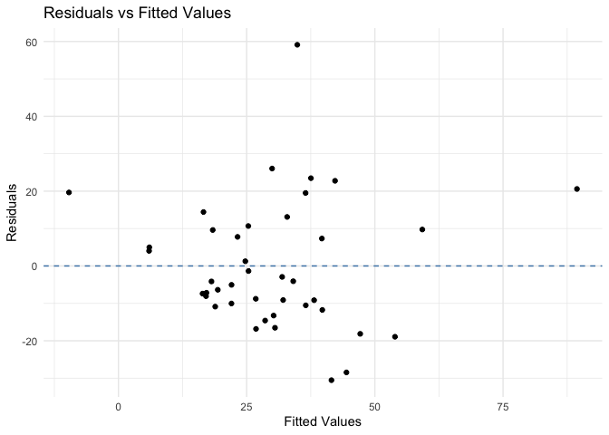
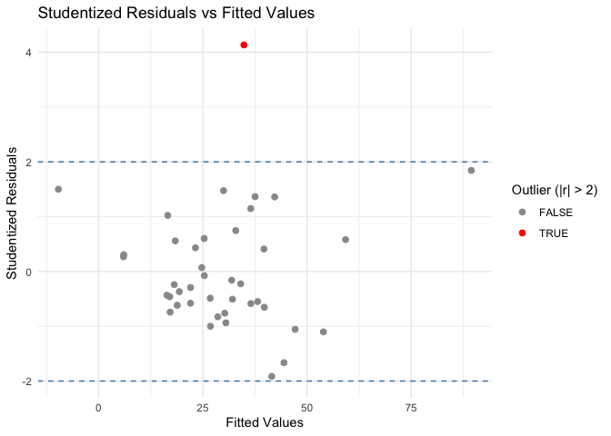

HW_4
================
2025-11-21

### Question 1

These data in the attached excel file relate to air pollution in 41 US
cities. There is a single dependent variable, the annual mean
concentration of sulfur dioxide, in micrograms per cubic meter. These
data generally relate to means for the three years 1969-71. The values
of six explanatory variables are also recorded, two of which relate to
human ecology, and four to climate. The variables are as follows:

Y: SO2 content of air in micrograms per cubic meter X1: Average annual
temperature in oF X2: Number of manufacturing enterprises employing 20
or more workers X3: Population size (1970 census); in thousands X4:
Average annual wind speed in miles per hour X5: Average annual
precipitation in inches X6: Average number of days with precipitation
per year For this data:

| count | city          |   y |   x1 |  x2 |  x3 |  x4 |    x5 |  x6 |
|------:|:--------------|----:|-----:|----:|----:|----:|------:|----:|
|     1 | Phoenix       |  10 | 70.3 | 213 | 582 | 6.0 |  7.05 |  36 |
|     2 | Little Rock   |  13 | 61.0 |  91 | 132 | 8.2 | 48.52 | 100 |
|     3 | San Francisco |  12 | 56.7 | 453 | 716 | 8.7 | 20.66 |  67 |
|     4 | Denver        |  17 | 51.9 | 454 | 515 | 9.0 | 12.95 |  86 |
|     5 | Hartford      |  56 | 49.1 | 412 | 158 | 9.0 | 43.37 | 127 |
|     6 | Wilmington    |  36 | 54.0 |  80 |  80 | 9.0 | 40.25 | 114 |

First few rows of Q1 dataset

###### (a) Fit the regression model

    ## 
    ## Call:
    ## lm(formula = y ~ x1 + x2 + x3 + x4 + x5 + x6, data = Q1)
    ## 
    ## Residuals:
    ##     Min      1Q  Median      3Q     Max 
    ## -27.652 -10.247   0.156   6.418  46.320 
    ## 
    ## Coefficients:
    ##              Estimate Std. Error t value Pr(>|t|)    
    ## (Intercept) 60.921348  38.694041   1.574 0.124647    
    ## x1          -0.873829   0.601496  -1.453 0.155458    
    ## x2           0.066052   0.016378   4.033 0.000295 ***
    ## x3          -0.042004   0.015641  -2.685 0.011118 *  
    ## x4          -0.086586   0.159257  -0.544 0.590202    
    ## x5           0.385820   0.368761   1.046 0.302822    
    ## x6          -0.002103   0.166032  -0.013 0.989968    
    ## ---
    ## Signif. codes:  0 '***' 0.001 '**' 0.01 '*' 0.05 '.' 0.1 ' ' 1
    ## 
    ## Residual standard error: 15.22 on 34 degrees of freedom
    ## Multiple R-squared:  0.6428, Adjusted R-squared:  0.5797 
    ## F-statistic:  10.2 on 6 and 34 DF,  p-value: 1.889e-06

###### (b) Obtain the multicollinearity diagnostics and take any necessary remedial action.

Check VIFs

``` r
vif(m1)
```

    ##        x1        x2        x3        x4        x5        x6 
    ##  3.264896 14.711473 14.173099  1.039226  3.255061  3.345714

Variable x2 (Number of manufacturing enterprises employing 20 or more
workers) and x3 (Population size (1970 census); in thousands) both have
VIFs greater than 10 which suggest high levels of multicollinearity.

We will remove one at a time and re run the model:

``` r
# Model without x2
m2 = lm(y ~ x1 + x3 + x4+ x5 + x6, data = Q1)
summary(m2)
```

    ## 
    ## Call:
    ## lm(formula = y ~ x1 + x3 + x4 + x5 + x6, data = Q1)
    ## 
    ## Residuals:
    ##     Min      1Q  Median      3Q     Max 
    ## -30.537 -10.528  -4.140   9.746  59.125 
    ## 
    ## Coefficients:
    ##              Estimate Std. Error t value Pr(>|t|)    
    ## (Intercept) 89.536365  45.584489   1.964 0.057489 .  
    ## x1          -1.614085   0.686448  -2.351 0.024464 *  
    ## x3           0.018791   0.005001   3.758 0.000625 ***
    ## x4          -0.129403   0.190428  -0.680 0.501266    
    ## x5           0.532944   0.439754   1.212 0.233663    
    ## x6           0.010141   0.198939   0.051 0.959636    
    ## ---
    ## Signif. codes:  0 '***' 0.001 '**' 0.01 '*' 0.05 '.' 0.1 ' ' 1
    ## 
    ## Residual standard error: 18.24 on 35 degrees of freedom
    ## Multiple R-squared:  0.4719, Adjusted R-squared:  0.3964 
    ## F-statistic: 6.254 on 5 and 35 DF,  p-value: 0.0003044

``` r
vif(m2)
```

    ##       x1       x3       x4       x5       x6 
    ## 2.960872 1.008728 1.034608 3.223206 3.344595

After removing x2, all variables have VIFs are below 5.

###### (c) Based on (b), re-run the multiple linear regression and show the residual plot.Comment on any observation

#### (b) Perform a residual plot and make any necessary transformations.

<!-- -->

Plot looks roughly like a cloud (o curvature or funneling effect), so no
transformation is necessary.

###### (d) Test for any outliers and take any remedial action

| count | city | y | x1 | x3 | x4 | x5 | x6 | residuals | fitted | hat | std_resid | stud_resid | cooks |
|---:|:---|---:|---:|---:|---:|---:|---:|---:|---:|---:|---:|---:|---:|
| 1 | Phoenix | 10 | 70.3 | 582 | 6.0 | 7.05 | 36 | 19.651 | -9.651 | 0.466 | 1.475 | 1.501 | 0.317 |
| 2 | Little Rock | 13 | 61.0 | 132 | 8.2 | 48.52 | 100 | -6.369 | 19.369 | 0.122 | -0.373 | -0.368 | 0.003 |
| 3 | San Francisco | 12 | 56.7 | 716 | 8.7 | 20.66 | 67 | -10.036 | 22.036 | 0.116 | -0.585 | -0.580 | 0.008 |
| 4 | Denver | 17 | 51.9 | 515 | 9.0 | 12.95 | 86 | -5.052 | 22.052 | 0.131 | -0.297 | -0.293 | 0.002 |
| 5 | Hartford | 56 | 49.1 | 158 | 9.0 | 43.37 | 127 | 19.509 | 36.491 | 0.122 | 1.142 | 1.147 | 0.030 |
| 6 | Wilmington | 36 | 54.0 | 80 | 9.0 | 40.25 | 114 | 10.679 | 25.321 | 0.068 | 0.606 | 0.601 | 0.004 |
| 7 | Washington | 29 | 57.3 | 757 | 9.3 | 38.89 | 111 | -2.923 | 31.923 | 0.030 | -0.163 | -0.160 | 0.000 |
| 8 | Jacksonville | 14 | 68.4 | 529 | 8.8 | 54.47 | 116 | -4.140 | 18.140 | 0.131 | -0.244 | -0.240 | 0.001 |
| 9 | Miami | 10 | 75.5 | 335 | 9.0 | 59.80 | 128 | 4.029 | 5.971 | 0.333 | 0.270 | 0.267 | 0.006 |
| 10 | Atlanta | 24 | 61.5 | 497 | 9.1 | 48.34 | 115 | -1.360 | 25.360 | 0.060 | -0.077 | -0.076 | 0.000 |
| 11 | Chicago | 110 | 50.6 | 3369 | 10.4 | 34.44 | 122 | 20.583 | 89.417 | 0.599 | 1.783 | 1.843 | 0.793 |
| 12 | lndianapolis | 28 | 52.3 | 746 | 9.7 | 38.74 | 121 | -11.756 | 39.756 | 0.040 | -0.658 | -0.653 | 0.003 |
| 13 | Des Moines | 17 | 49.0 | 201 | 11.2 | 30.85 | 103 | -13.260 | 30.260 | 0.101 | -0.767 | -0.762 | 0.011 |
| 14 | Wichita | 8 | 56.6 | 277 | 12.7 | 30.58 | 82 | -10.870 | 18.870 | 0.083 | -0.623 | -0.617 | 0.006 |
| 15 | Louisville | 30 | 55.6 | 593 | 8.3 | 43.11 | 123 | -4.085 | 34.085 | 0.038 | -0.228 | -0.225 | 0.000 |
| 16 | New Orleans | 9 | 68.3 | 361 | 8.4 | 56.77 | 113 | -7.392 | 16.392 | 0.143 | -0.438 | -0.433 | 0.005 |
| 17 | Baltimore | 47 | 55.0 | 905 | 9.6 | 41.31 | 111 | 7.333 | 39.667 | 0.058 | 0.414 | 0.409 | 0.002 |
| 18 | Detroit | 35 | 49.9 | 1513 | 10.1 | 30.96 | 129 | -18.926 | 53.926 | 0.108 | -1.099 | -1.103 | 0.024 |
| 19 | Minneapolis St Paul | 29 | 43.5 | 744 | 10.6 | 25.94 | 137 | -18.146 | 47.146 | 0.109 | -1.054 | -1.056 | 0.023 |
| 20 | Kansas City | 14 | 54.5 | 507 | 10.0 | 37.00 | 99 | -16.525 | 30.525 | 0.068 | -0.939 | -0.937 | 0.011 |
| 21 | St Louis | 56 | 55.9 | 622 | 9.5 | 35.89 | 105 | 26.040 | 29.960 | 0.031 | 1.451 | 1.475 | 0.011 |
| 22 | Omaha | 14 | 51.5 | 347 | 10.9 | 30.18 | 98 | -14.599 | 28.599 | 0.071 | -0.831 | -0.827 | 0.009 |
| 23 | Albuquerque | 11 | 56.8 | 244 | 8.9 | 7.77 | 58 | 4.981 | 6.019 | 0.222 | 0.310 | 0.306 | 0.005 |
| 24 | Albany | 46 | 47.6 | 116 | 8.8 | 33.36 | 135 | 13.105 | 32.895 | 0.084 | 0.751 | 0.746 | 0.009 |
| 25 | Buffalo | 11 | 47.1 | 463 | 12.4 | 36.11 | 166 | -30.537 | 41.537 | 0.176 | -1.845 | -1.914 | 0.121 |
| 26 | Cincinnati | 23 | 54.0 | 453 | 7.1 | 39.04 | 132 | -9.114 | 32.114 | 0.046 | -0.512 | -0.506 | 0.002 |
| 27 | Cleveland | 65 | 49.7 | 751 | 10.9 | 34.99 | 155 | 22.762 | 42.238 | 0.137 | 1.343 | 1.360 | 0.048 |
| 28 | Columbus | 26 | 51.5 | 540 | 8.6 | 37.01 | 134 | -10.528 | 36.528 | 0.046 | -0.591 | -0.586 | 0.003 |
| 29 | Philadelphia | 69 | 54.6 | 1950 | 9.6 | 39.93 | 115 | 9.746 | 59.254 | 0.171 | 0.587 | 0.581 | 0.012 |
| 30 | Pittsburgh | 61 | 50.4 | 520 | 9.4 | 36.22 | 147 | 23.465 | 37.535 | 0.089 | 1.348 | 1.365 | 0.030 |
| 31 | Providence | 94 | 50.0 | 179 | 10.6 | 42.75 | 125 | 59.125 | 34.875 | 0.102 | 3.422 | 4.134 | 0.222 |
| 32 | Memphis | 10 | 61.6 | 624 | 92.0 | 49.10 | 105 | -7.162 | 17.162 | 0.724 | -0.748 | -0.743 | 0.245 |
| 33 | Nashville | 18 | 59.4 | 448 | 7.9 | 46.00 | 119 | -8.778 | 26.778 | 0.048 | -0.493 | -0.488 | 0.002 |
| 34 | Dallas | 9 | 66.2 | 844 | 10.9 | 35.94 | 78 | -8.078 | 17.078 | 0.100 | -0.467 | -0.462 | 0.004 |
| 35 | Houston | 10 | 68.9 | 1233 | 10.8 | 48.19 | 103 | -16.825 | 26.825 | 0.148 | -1.000 | -1.000 | 0.029 |
| 36 | Salt Lake City | 28 | 51.0 | 176 | 8.7 | 15.17 | 89 | 9.613 | 18.387 | 0.124 | 0.563 | 0.558 | 0.008 |
| 37 | Norfolk | 31 | 59.3 | 308 | 10.6 | 44.68 | 116 | 7.775 | 23.225 | 0.046 | 0.436 | 0.431 | 0.002 |
| 38 | Riebmond | 26 | 57.8 | 299 | 7.6 | 42.59 | 115 | 1.258 | 24.742 | 0.044 | 0.071 | 0.070 | 0.000 |
| 39 | Seattle | 29 | 51.1 | 531 | 9.4 | 38.79 | 164 | -9.154 | 38.154 | 0.182 | -0.555 | -0.549 | 0.011 |
| 40 | Charleston | 31 | 55.2 | 71 | 65.0 | 40.75 | 148 | 14.420 | 16.580 | 0.402 | 1.023 | 1.023 | 0.117 |
| 41 | Milwaukee | 16 | 45.7 | 717 | 11.8 | 29.07 | 123 | -28.459 | 44.459 | 0.076 | -1.623 | -1.664 | 0.036 |

Look a the studentized residuals (standardized residuals, r) to find
outliers. If $|r| > 2$, this point is as an outlier.

    ## # A tibble: 1 × 14
    ##   count city           y    x1    x3    x4    x5    x6 residuals fitted   hat
    ##   <dbl> <chr>      <dbl> <dbl> <dbl> <dbl> <dbl> <dbl>     <dbl>  <dbl> <dbl>
    ## 1    31 Providence    94    50   179  10.6  42.8   125      59.1   34.9 0.102
    ## # ℹ 3 more variables: std_resid <dbl>, stud_resid <dbl>, cooks <dbl>

It appears that only one point fits the criteria to be an outlier: point
31 for Providence (\|studentized residuals\| \> 4).

Graphically, we can see visualize our outlier. We can see outliers
graphically below:
<!-- -->

After removing this point from our dataset, we can refit the model.

###### (e) Based on (d), re-run the multiple linear regression

    ## 
    ## Call:
    ## lm(formula = y ~ x1 + x3 + x4 + x5 + x6, data = Q1_final)
    ## 
    ## Residuals:
    ##     Min      1Q  Median      3Q     Max 
    ## -29.679  -8.669  -2.598  10.595  28.344 
    ## 
    ## Coefficients:
    ##              Estimate Std. Error t value Pr(>|t|)    
    ## (Intercept) 53.463093  38.723972   1.381   0.1764    
    ## x1          -1.034482   0.585183  -1.768   0.0861 .  
    ## x3           0.021007   0.004173   5.034 1.55e-05 ***
    ## x4          -0.100308   0.157766  -0.636   0.5292    
    ## x5           0.194559   0.373053   0.522   0.6054    
    ## x6           0.123087   0.166904   0.737   0.4659    
    ## ---
    ## Signif. codes:  0 '***' 0.001 '**' 0.01 '*' 0.05 '.' 0.1 ' ' 1
    ## 
    ## Residual standard error: 15.09 on 34 degrees of freedom
    ## Multiple R-squared:  0.566,  Adjusted R-squared:  0.5022 
    ## F-statistic: 8.868 on 5 and 34 DF,  p-value: 1.829e-05

WHAT ABOUT THE FACT THAT OUR PVALUES ARE HIGH?!!?!?!

After remediation, here is the **final model** rounded to three
decimals:

$Y= 53.463 -1.034X_1 + 0.021X_3 -0.100X_4 +0.195X_5 +0.123X_6$

###### (f) Perform a stepwise regression and obtain the best model.

``` r
Q2_stepwise_model <- step(m3_final, direction = "both")
```

    ## Start:  AIC=222.64
    ## y ~ x1 + x3 + x4 + x5 + x6
    ## 
    ##        Df Sum of Sq     RSS    AIC
    ## - x5    1      62.0  7807.2 220.96
    ## - x4    1      92.1  7837.3 221.11
    ## - x6    1     123.9  7869.2 221.27
    ## <none>               7745.3 222.64
    ## - x1    1     711.9  8457.2 224.16
    ## - x3    1    5771.8 13517.0 242.91
    ## 
    ## Step:  AIC=220.96
    ## y ~ x1 + x3 + x4 + x6
    ## 
    ##        Df Sum of Sq     RSS    AIC
    ## - x4    1      79.7  7886.9 219.36
    ## <none>               7807.2 220.96
    ## + x5    1      62.0  7745.3 222.64
    ## - x6    1     832.3  8639.5 223.01
    ## - x1    1    1054.5  8861.7 224.03
    ## - x3    1    5782.5 13589.7 241.13
    ## 
    ## Step:  AIC=219.36
    ## y ~ x1 + x3 + x6
    ## 
    ##        Df Sum of Sq     RSS    AIC
    ## <none>               7886.9 219.36
    ## + x4    1      79.7  7807.2 220.96
    ## + x5    1      49.5  7837.3 221.11
    ## - x6    1     777.8  8664.7 221.12
    ## - x1    1    1136.3  9023.2 222.75
    ## - x3    1    5899.1 13785.9 239.70

``` r
summary(Q2_stepwise_model)
```

    ## 
    ## Call:
    ## lm(formula = y ~ x1 + x3 + x6, data = Q1_final)
    ## 
    ## Residuals:
    ##     Min      1Q  Median      3Q     Max 
    ## -31.045  -9.188  -1.711   9.838  29.254 
    ## 
    ## Coefficients:
    ##              Estimate Std. Error t value Pr(>|t|)    
    ## (Intercept) 40.421284  27.206116   1.486   0.1461    
    ## x1          -0.823522   0.361602  -2.277   0.0288 *  
    ## x3           0.021189   0.004083   5.189 8.42e-06 ***
    ## x6           0.184345   0.097833   1.884   0.0676 .  
    ## ---
    ## Signif. codes:  0 '***' 0.001 '**' 0.01 '*' 0.05 '.' 0.1 ' ' 1
    ## 
    ## Residual standard error: 14.8 on 36 degrees of freedom
    ## Multiple R-squared:  0.5581, Adjusted R-squared:  0.5212 
    ## F-statistic: 15.15 on 3 and 36 DF,  p-value: 1.541e-06

In R, stepwise adds and removes predictors until AIC is minimized. AIC
balances two factors: model fit (better fit → lower AIC) AND model
simplicity (fewer parameters → lower AIC)

Note: Becuase it uses AIC, I cannot set my alpha_1 or alpha_2 levels
like we talked about in class.

After stepwise (forwards and backwards), our best model is the
following:

$Y= 40.421 - 0.824X_1 + 0.021X_3 + 0.184X_6$

### Question 2

The table shows the cross classification of the respondents to a survey
according to psychotropic drug use, age, sex, and whether or not they
had a physical illness.

Determine if there is a relationship between psychotropic drug use and
physical illness, adjusting for age group and gender

``` r
#Import Data

Q2 = read_excel("data/Q2_p4_data.xlsx") |> 
  janitor::clean_names() |> 
    rename(
      total_ill = ill_total,
      drugs_ill = ill_taking_drugs,
      total_notill = not_ill_total,
      drugs_notill = not_ill_taking_drugs
    )
```

``` r
#pivot data to ungroup my variables 
Q2_long <- Q2 |> 
  pivot_longer(
    cols = c(total_ill, drugs_ill,
             total_notill, drugs_notill),
    names_to = c(".value", "illness"),  #".value" = Use part of the column name as the names of the output columns
    names_pattern = "(.*)_(.*)") |> 
    mutate( illness = factor(illness, levels = c("notill", "ill")))

#factor illness so that notill becomes the reference group when i run my model
```

Run my group level logistic regression

``` r
Q2_m1 <- glm(cbind(drugs, total - drugs) ~ illness + age + sex,
  family = binomial,
  data = Q2_long
)

summary(Q2_m1)
```

    ## 
    ## Call:
    ## glm(formula = cbind(drugs, total - drugs) ~ illness + age + sex, 
    ##     family = binomial, data = Q2_long)
    ## 
    ## Coefficients:
    ##             Estimate Std. Error z value Pr(>|z|)    
    ## (Intercept)  -4.2575     0.4488  -9.485  < 2e-16 ***
    ## illnessill    1.9380     0.3423   5.661  1.5e-08 ***
    ## age>= 55      1.0064     0.4324   2.327   0.0200 *  
    ## age35-54      0.8824     0.4414   1.999   0.0456 *  
    ## sexMales     -1.3025     0.2988  -4.359  1.3e-05 ***
    ## ---
    ## Signif. codes:  0 '***' 0.001 '**' 0.01 '*' 0.05 '.' 0.1 ' ' 1
    ## 
    ## (Dispersion parameter for binomial family taken to be 1)
    ## 
    ##     Null deviance: 113.7029  on 11  degrees of freedom
    ## Residual deviance:   8.4868  on  7  degrees of freedom
    ## AIC: 53.488
    ## 
    ## Number of Fisher Scoring iterations: 5

``` r
#using glm() gneralized linear model 
#family = binomial means logistic regression 
#cbind(drugs, total - drugs) tells R that my data is on the group level --> Each row in my dataset does not represent 1 person — it represents a group of people.
    #drugs = number of successes 
    #total-drugs = number of failures
#then "~" fit my model using the predictors illness, age, and sex --> Model the probability of taking drugs using illness status, age, and sex.
```

``` r
#OR
exp(1.9380)
```

    ## [1] 6.944847

``` r
#CI
confint(Q2_m1)
```

    ## Waiting for profiling to be done...

    ##                   2.5 %    97.5 %
    ## (Intercept) -5.23199454 -3.456019
    ## illnessill   1.30626528  2.660072
    ## age>= 55     0.21586092  1.935032
    ## age35-54     0.06801492  1.823847
    ## sexMales    -1.92264711 -0.743457

``` r
exp(1.30626528)  
```

    ## [1] 3.692358

``` r
exp(2.660072)
```

    ## [1] 14.29732

``` r
exp(confint(Q2_m1))
```

    ## Waiting for profiling to be done...

    ##                   2.5 %      97.5 %
    ## (Intercept) 0.005342858  0.03155514
    ## illnessill  3.692358019 14.29731346
    ## age>= 55    1.240929781  6.92426432
    ## age35-54    1.070381274  6.19564834
    ## sexMales    0.146219390  0.47546740

``` r
#exponentiate beta of illness_ill to get odds ratio
```

**INTERPRETATION:**

After adjusting for age and gender, the odds of taking psychotropic
drugs for physically ill individuals is, on average, 6.94 times the odds
of taking psychotropic drugs for not physically ill individuals (95% CI:
3.69, 14.30, p \< 0.001). The p-value is \< 0.05 which suggests at a 5%
level of significance, this association is statistically significant.
